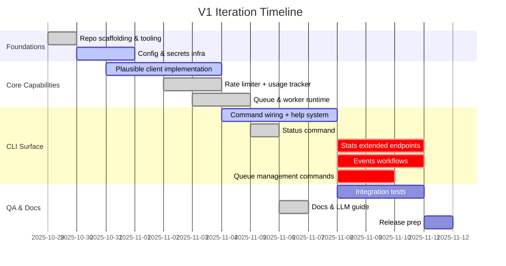

# Plausible CLI – V1 Delivery Plan

## Vision
Deliver an ergonomic CLI that surfaces Plausible Analytics capabilities to humans and LLMs, while respecting rate limits, juggling multiple accounts, and enabling queued API execution.

## Current Status — 2025-10-29
- ✅ Foundations in place: repo scaffolding, account store (file-backed), Plausible client (sites + stats aggregate), rate limiter scaffold, queue/worker, baseline CLI commands (`status`, `sites list`, `stats aggregate`, `events template`, `accounts` CRUD), docs/LLM artefacts, CI wiring (latest on `main` @ a38358b).
- ⏳ Features to extend: events `send/import`, stats `timeseries` & `breakdown`, queue `inspect/drain`, additional Plausible endpoint coverage (sites CRUD, events POST), daily budget configurability, secure keyring fallback.
- 🔬 Test gaps: integration coverage via `assert_cmd`, expanded HTTP mocks (sites CRUD, events POST), JSON snapshot assertions, rate-limit exhaustion/backpressure scenarios.
- 🚀 Distribution polish pending: GitHub release workflow, `cargo install` docs, Homebrew tap automation, tagged release + changelog.
- 🧭 Next sprint focus: close remaining CLI surface + persistence polish, then broaden tests before first public release.

## Release Scope
- Sites, Stats, Events API coverage.
- Multi-account storage with secure API key handling.
- Rate-limit aware dispatcher with `status` reporting.
- CLI help rich in examples, machine-readable outputs, and LLM-friendly docs.
- Robust test suite driven by TDD, CI-ready.

## Development Methodology
- Test-driven for all core modules (client, rate limiter, account store, queue).
- Pair unit tests with contract/integration tests using HTTP mocks.
- Continuous linting (`clippy`), formatting (`rustfmt`), and security (`cargo deny`) as pre-commit and CI gates.

## Iteration Plan

## Work Breakdown Structure

### 1. Repository & Tooling
- `cargo new plausible-cli`.
- Configure workspace linting targets in `justfile` or `Makefile.toml`.
- Integrate `cargo fmt`, `cargo clippy`, `cargo-nextest`, `cargo deny`, `cargo audit`.
- Setup GitHub Actions workflow skeleton.

### 2. Configuration & Account Management
- Implement config dir resolver using `directories`.
- Build account store with pluggable credential backends (`keyring`, file).
- Add CLI commands: `accounts list/add/use/remove/export`.
- Tests: ensure secrets masked, duplicates handled, `set_default` persists.

### 3. Plausible HTTP Client
- Data models per endpoint (`serde` with `rename_all = "camelCase"`).
- Request builders with optional parameters and typed filters.
- HTTP layer using `reqwest` with `tracing` instrumentation.
- Error handling: map Plausible errors, HTTP errors, auth issues.
- Tests: use `wiremock` to assert request paths, headers (`Authorization: Bearer`), query params, retries on 429.

### 4. Rate Limiter & Usage Ledger
- ✅ Implement hourly token bucket using `governor`.
- ⏳ Add configurable daily budget with persistent ledger (JSON or `sled`).
- ✅ Provide metrics: remaining hourly/daily, last reset times.
- ✅ Tests: simulate rapid enqueues to confirm blocking/backoff, ledger reset at midnight (add coverage for daily overrides once implemented).

### 5. Intent Queue & Worker Runtime
- ✅ Define `Intent` enum per command.
- ✅ Foreground enqueues intents; background worker processes sequentially.
- ✅ Telemetry channel for progress updates.
- ⏳ Handle retries, exponential backoff, cancellation on shutdown.
- ⏳ Tests: concurrency under load, ensures queue drains, error propagation.

### 6. CLI Commands & Output
- ✅ Sites `list`; ⏳ `create/update/reset/delete`.
- ✅ Stats `aggregate`; ⏳ `timeseries/breakdown/realtime` with shared flags.
- ✅ Events `template`; ⏳ `send/import`.
- ⏳ Queue `inspect/drain`.
- ✅ Status (reports account, limits, queue stats, API health).
- ✅ Formatters: tables (human), JSON (machine).
- ⏳ Snapshot tests with `insta` or `similar`.

### 7. Documentation & Help System
- ✅ README + `llms-full.txt` generated from doc templates (manual sync script pending).
- ⏳ Command help auto-generated plus curated examples.
- ⏳ `plausible prompt examples --llm` to export LLM-ready instructions.
- ⏳ Ensure `--examples` and `--json-schema` subcommands deliver up-to-date docs.

### 8. QA & Release
- ⏳ Integration tests hitting Plausible sandbox via mocked responses.
- ⏳ Smoke tests with real API key (manual pre-release checklist).
- ⏳ Version tagging scheme (SemVer) and release notes template.
- ⏳ Packaging: `cargo install`, GitHub release, optional Homebrew tap.

## Design Patterns & Conventions
- Command Pattern: CLI commands convert to `Intent` jobs.
- Strategy Pattern: Rate limit policy swappable (hourly-only vs hourly+daily).
- Repository Pattern: Account storage abstracted for keychain vs file.
- Observer Pattern: Telemetry subscribers for `status` command and logging.
- Error Enrichment: `thiserror` for domain errors.
- Structuring: `lib` crate for logic + thin `bin` wrappers to enable integration tests.

## Testing Matrix

| Area | Tests | Tools |
|------|-------|-------|
| Account Store | add/set/remove, persistence, masking | `tempfile`, `assert_fs` |
| HTTP Client | request construction, retries, error mapping | `wiremock`, `serde_json` |
| Rate Limiter | token bucket exhaustion, ledger rollover | `tokio-test`, `chrono` |
| Queue | job ordering, retry semantics | `tokio::test`, manual channel asserts |
| CLI | `--help`, sample commands, JSON output | `assert_cmd`, `insta` |
| Docs | lint markdown, ensure examples compile | `cargo mdbook test` (optional) |

## Acceptance Criteria
- All commands documented with examples and help output verified via snapshot tests.
- `plausible status` reports accurate limits before/after job execution.
- Queue gracefully handles more than 600 requests in burst, spreading over time.
- Multi-account operations are atomic and safe with concurrent worker runs.
- LLM documentation includes at least three canonical prompts and JSON schemas.

## Risks & Mitigations
- **Rate limit misinterpretation**: cross-check with live API; allow user override and logging.
- **Credential security**: encourage keychain use; fallback file has restricted permissions.
- **Complex queue behavior**: extensive integration tests, manual soak.
- **Docs drift**: adopt doc generation script tied to command metadata.

## Open Questions
- Should we ship default daily budget or require explicit configuration?
- Do we need offline caching for stats (to reduce API usage)?
- Preferred serialization for `--json` (compact vs pretty) defaults?
- Need for plugin hooks before v1?

## Definition of Done
- ✅ CI pipeline green (lint, fmt, tests, deny).
- ✅ README + `llms-full.txt` merged and validated.
- ⏳ Tagged release candidate with changelog summarizing features.
- ⏳ Post-release checklist: publish crate or instructions, Homebrew tap update.

## Next Implementation Priorities (TDD-First)
1. **Stats timeseries/breakdown**  
   - Red tests: extend `client` module mocks to capture new endpoints, add CLI integration snapshots (human + JSON).  
   - Green: implement API calls, queue intents, CLI wiring, output rendering, ensure rate-limit weights captured.
2. **Events send/import workflows**  
   - Red tests: event payload validation unit tests, CLI integration for `send` (stdin + flags) and `import` (NDJSON reader with `--dry-run`), worker interactions verifying queue submission.  
   - Green: implement request builders, streaming uploads, background processing, success/failure telemetry.  
   - Refactor: share schema templates between docs and runtime.
3. **Queue management commands**  
   - Red tests: queue inspection snapshots demonstrating ordering, drain command ensuring telemetry updates.  
   - Green: introspection APIs on queue, CLI commands, optional `--json`.
4. **Rate limit daily budget & keyring integration**  
   - Red tests: ledger persistence with configurable daily caps, platform keyring mock verifying fallback logic.  
   - Green: configuration plumbing, CLI flags/environment overrides, migration script for existing users.
5. **Distribution pipeline**  
   - Red tests: check GitHub workflow via `cargo xtask` smoke (or script).  
   - Green: publish workflow, Homebrew tap formula generation, README install section refinements.
