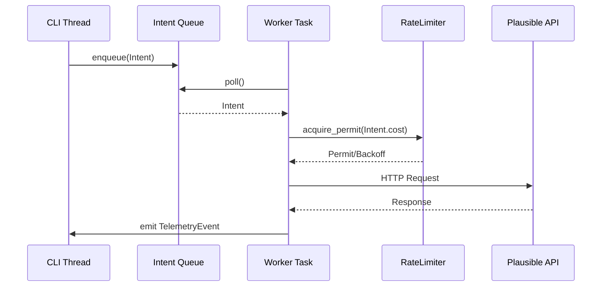

# Plausible CLI – Architecture Overview

## Goals
- Deliver a Rust-based CLI for Plausible Analytics that is LLM-friendly and human-usable.
- Provide multi-account management, rate-limit awareness (default 600 req/hour with optional daily budget), and rich help/examples.
- Support queued API execution with a background worker to smooth bursty usage.
- Expose machine-readable JSON outputs and human-readable table narratives.

## API Surface Summary

### Authentication
- Personal API tokens scoped per Plausible account.
- Stored locally using configurable backends (`keyring` + config file fallback) and masked in logs.

### Sites API
- List, create, update, reset statistics, and delete sites.
- Typical queries:
  - `GET /api/v1/sites` → enumerate domains.
  - `POST /api/v1/sites/{site_id}/reset-stats` → reset by date.

### Stats API
- Endpoints: `aggregate`, `timeseries`, `breakdown`, `realtime/visitors`.
- Query parameters allow filters (`filters=event:page==/docs`), metrics (`visitors`, `pageviews`), intervals (`period=custom&date=2024-01-01,2024-01-31`), sorting, and pagination.

### Events API
- `POST /api/v1/events` for custom goals and retroactive imports.
- Payload carries base fields (`name`, `url`, `domain`) plus optional UTM and custom props.

## Command Surface

### `plausible help`
- Generated by `clap` with `command_factory`.
- Adds `--examples` to print curated request patterns for LLM prompt injection.

### `plausible accounts`
- `list` – show stored accounts with default marker.
- `add` – interactive/flags to capture label + API key; uses OS keychain when available.
- `use` – set default account, updates config.
- `remove` – delete account; optional `--purge-usage`.
- `export` – print machine-readable account metadata sans secrets for automation.

### `plausible sites`
- `list` – summarize domains, visibility status, timezone.
- `create` – accept domain, timezone, optional public flag.
- `update` – patch properties via key-value flags.
- `reset` – trigger stats reset with date range confirmation.
- `delete` – queued destructive call requiring confirmation.

### `plausible stats`
- `aggregate` – returns KPI metrics; supports `--metric` repeatable flags.
- `timeseries` – emits chronologically sorted rows; optional `--json` or `--csv`.
- `breakdown` – slices by dimensions with pagination; handles `--dimension` values.
- `realtime` – fetch visitors currently on site.
- Shared flags: `--site`, `--period|--date`, `--filters`, `--props`, `--format`.

### `plausible events`
- `send` – post events from CLI or piped JSON.
- `import` – batch read newline-delimited events with optional `--dry-run`.
- `template` – print example payload for copy/paste or LLM usage.

### `plausible queue`
- `drain` – force worker to process queued jobs.
- `inspect` – display pending requests, retry counts, and ETA per job.

### `plausible status`
- Display current account, API health, queued job counts, remaining hourly/daily budget, last reset timestamp.
- `--json` flag ensures deterministic schema for LLM parsing.

## Architectural Layers

```mermaid
graph TD
    A[CLI Commands (clap)] --> B[Command Handlers]
    B --> C[Intent Queue (mpsc)]
    C --> D[Worker Runtime (tokio)]
    D --> E[Plausible Client (reqwest)]
    E --> F[Plausible APIs]
    B --> G[Account Store]
    B --> H[Usage Tracker]
    G --> I[Config Persistence (toml + keyring)]
    H --> J[Usage Ledger (local JSON/Sled)]
```

### Core Modules
- `cli`: argument parsing, output formatting (ANSI tables + JSON).
- `core::client`: typed REST client, response models, retry policy.
- `core::rate_limit`: governor-based token bucket + daily allowance, exposes `acquire()` future.
- `core::accounts`: manages credential store, environment overrides, account selection.
- `queue`: abstractions for intents, worker loop, telemetry events.
- `telemetry`: structured logging via `tracing`, progress events for status command.
- `persistence`: wrappers around config dir layout (`dirs` crate), storing usage, cached schema versions.

## Background Worker Flow



- Intents include metadata (account id, endpoint path, estimated weight).
- RateLimiter returns permits immediately or schedules wake-up.
- Worker emits telemetry (success, retry, exhausted) consumed by status command.

## Rate Limiting Strategy
- Hourly budget default of 600, configurable daily soft cap stored in usage ledger.
- Token bucket capacity can be tuned per account; draining resets at top of hour.
- Daily ledger resets on local midnight; `plausible status --reset-usage` manually clears counters.
- Worker tracks `RetryAfter` headers, applies exponential backoff (base 2, capped 60s).

## Multi-Account Handling
- Config directory: `~/.config/plausible-cli/`
  - `config.toml` – metadata, default account alias.
  - `accounts.json` – API key references (encrypted or placeholders).
  - `usage.json` – rate-limit counters per account, day, endpoint category.
- Accounts referenced by slug (e.g., `prod`, `staging`).
- Environment variable overrides: `PLAUSIBLE_ACCOUNT`, `PLAUSIBLE_API_KEY`.

## Output Modes
- Human readable tables via `tabled` or `comfy-table`.
- Machine readable JSON/NDJSON for LLM ingestion.
- Optional `--output file` to stream JSON to disk; ensures asynchronous writer handles partial flush.

## Error Handling & Observability
- Use `color-eyre` or `anyhow` for rich errors; map to exit codes.
- Structured logs using `tracing-subscriber`; support `--log json`.
- Worker instrumentation exported via `/tmp/plausible-cli.sock` optional metrics for advanced integration.

## Security Considerations
- Keys never echoed; redact logs.
- `keyring` usage optional; fallback to file with mode `0o600`.
- Provide `plausible accounts rotate` workflow to replace API keys atomically.

## Versioning & Distribution
- Minimum Supported Rust Version (MSRV): 1.75.
- Distribution through GitHub Releases + `cargo install --git`.
- Provide Homebrew tap formula script.
- Include `plausible-cli --version` embedding git SHA when built from source.

## Integration with LLM Agents
- `plausible --json --compact` ensures small tokens.
- Document canonical prompts in `llms-full.txt`.
- `--dry-run` mode prints would-be HTTP payload for safe evaluation.
- Provide `plausible prompt examples --llm` command to dump curated instructions.

## Dependency Management
- Use `cargo-deny` to audit licenses.
- Pin direct dependencies via `Cargo.lock` committed to repo.
- Optional features: `native-tls` vs `rustls-tls`.

## Concurrency Model
- Foreground thread handles CLI parsing and rendering.
- Background Tokio runtime handles intents, HTTP, rate limiter.
- Channels:
  - `mpsc` bounded queue (default 128) for intents.
  - `broadcast` for telemetry subscribers (`status` command attaches).
  - `oneshot` for synchronous commands awaiting immediate result.

## Persistence Model
- Sled (embedded DB) optional; default JSON files for simplicity.
- Provide migration hooks when schema evolves; version tracked in `usage.json`.

## Diagnostics & Tooling
- `plausible debug http` captures last N requests/responses for troubleshooting.
- `plausible doctor` checks config, network reachability, API health, and warns about outdated Rust toolchain.

## Future Enhancements
- Websocket support if Plausible exposes streaming.
- Plugin architecture for custom exporters.
- Integration with background schedulers (cron/backfill).
